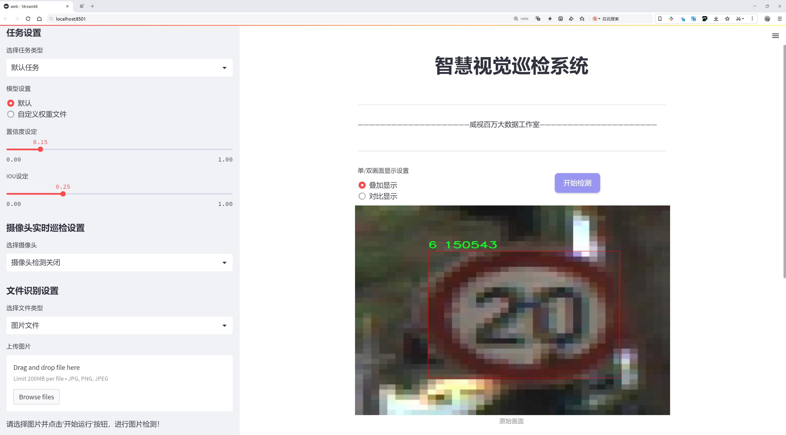
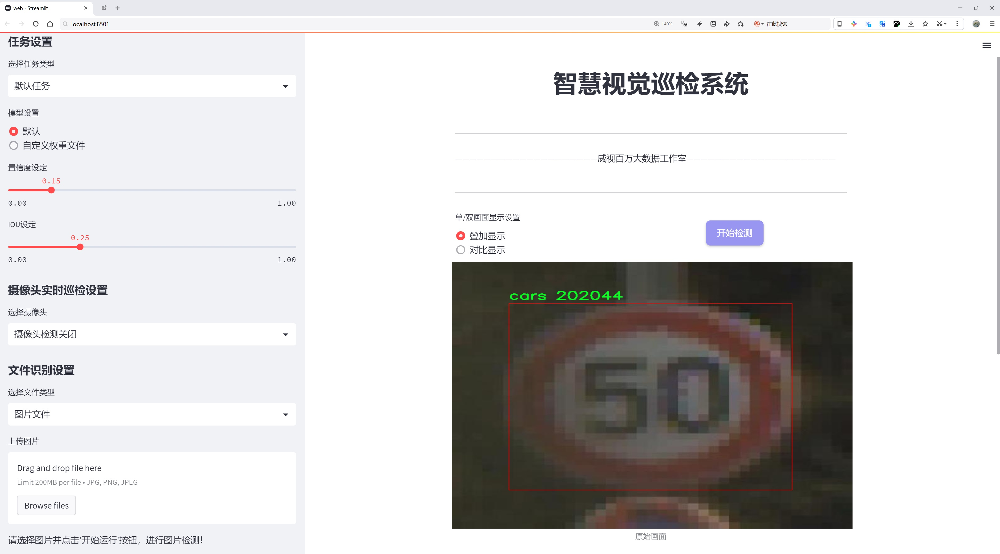
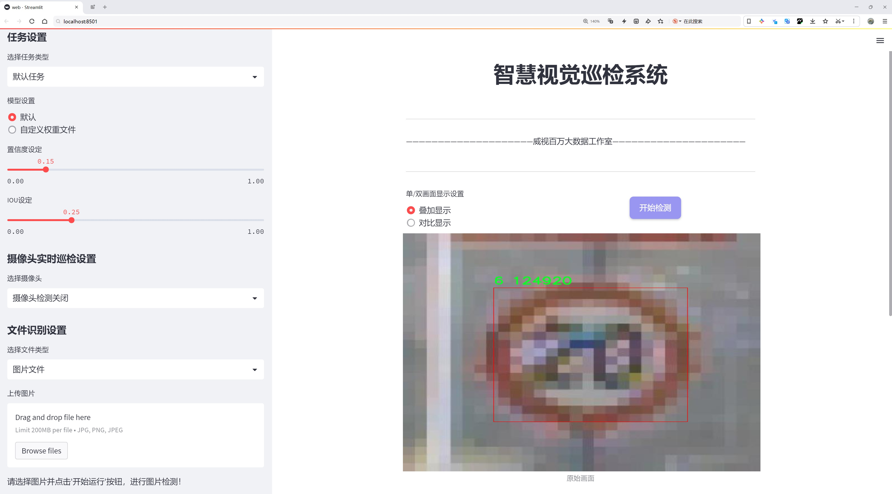
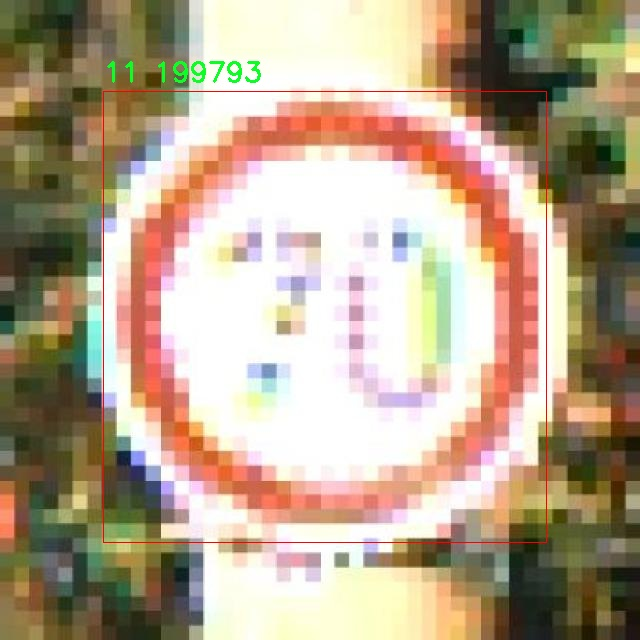
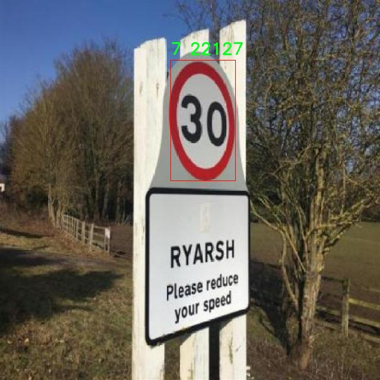
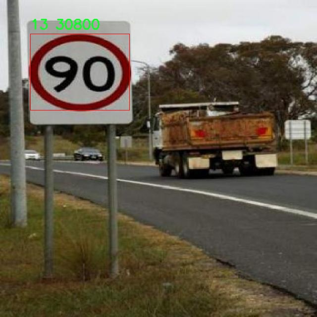
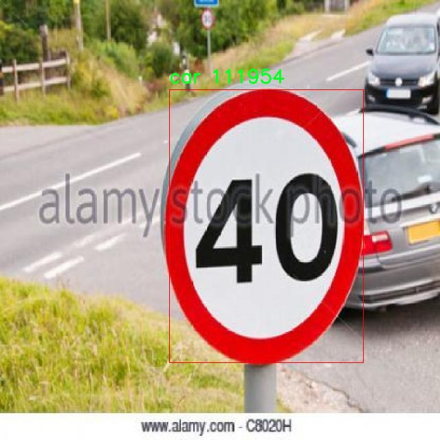
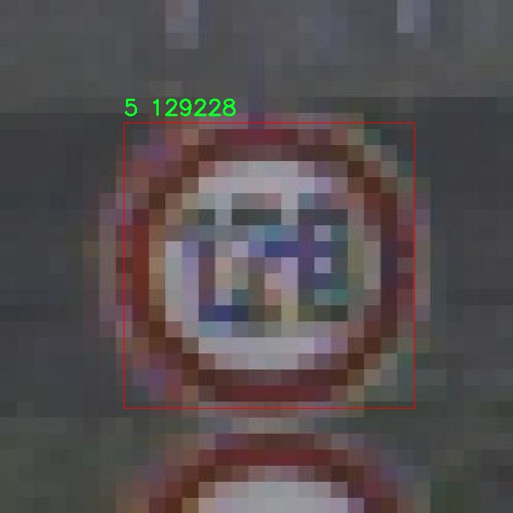

# 自动驾驶车辆检测检测系统源码分享
 # [一条龙教学YOLOV8标注好的数据集一键训练_70+全套改进创新点发刊_Web前端展示]

### 1.研究背景与意义

项目参考[AAAI Association for the Advancement of Artificial Intelligence](https://gitee.com/qunshansj/projects)

项目来源[AACV Association for the Advancement of Computer Vision](https://gitee.com/qunmasj/projects)

研究背景与意义

随着智能交通系统的快速发展，自动驾驶技术逐渐成为现代交通领域的重要研究方向。自动驾驶车辆的安全性和可靠性是实现其广泛应用的关键，而高效的目标检测系统则是确保自动驾驶车辆能够准确识别周围环境的重要组成部分。近年来，深度学习技术的飞速发展为目标检测提供了新的解决方案，其中YOLO（You Only Look Once）系列模型因其高效性和实时性受到广泛关注。YOLOv8作为该系列的最新版本，具备了更强的特征提取能力和更快的推理速度，成为研究人员和工程师们在自动驾驶领域的重要工具。

在自动驾驶车辆的应用场景中，准确识别各种交通参与者（如行人、其他车辆、交通标志等）是确保行车安全的前提。根据所提供的数据集信息，该数据集包含8500张图像，涵盖15个类别，主要集中在汽车的检测上。这一数据集为研究人员提供了丰富的训练和测试样本，使得基于YOLOv8的自动驾驶车辆检测系统的构建成为可能。通过对这些图像的分析和处理，研究人员可以训练出一个高效的目标检测模型，从而提高自动驾驶系统在复杂环境下的识别能力。

在现有的YOLOv8模型基础上进行改进，不仅可以提升模型的检测精度，还可以优化其在实时场景中的表现。具体而言，改进可以集中在模型结构的优化、损失函数的调整以及数据增强技术的应用等方面。这些改进措施将有助于模型更好地适应不同光照、天气和道路条件下的检测任务，从而提升自动驾驶车辆在实际应用中的安全性和可靠性。

此外，随着城市化进程的加快，交通拥堵和交通事故频发的问题日益严重。自动驾驶技术的推广有望缓解这些问题，提高交通效率，降低事故发生率。因此，基于改进YOLOv8的自动驾驶车辆检测系统的研究不仅具有重要的学术价值，还有着广泛的社会意义。通过实现更高效的目标检测，能够为自动驾驶技术的商业化应用提供有力支持，推动智能交通的发展。

综上所述，基于改进YOLOv8的自动驾驶车辆检测系统的研究，不仅是对深度学习技术在目标检测领域应用的探索，更是对自动驾驶技术发展的重要推动。通过利用现有的数据集，研究人员可以深入分析和解决自动驾驶过程中面临的各种挑战，为未来的智能交通系统奠定坚实的基础。随着技术的不断进步和数据集的不断丰富，基于YOLOv8的检测系统有望在自动驾驶领域发挥越来越重要的作用，推动整个行业的创新与发展。

### 2.图片演示







##### 注意：由于此博客编辑较早，上面“2.图片演示”和“3.视频演示”展示的系统图片或者视频可能为老版本，新版本在老版本的基础上升级如下：（实际效果以升级的新版本为准）

  （1）适配了YOLOV8的“目标检测”模型和“实例分割”模型，通过加载相应的权重（.pt）文件即可自适应加载模型。

  （2）支持“图片识别”、“视频识别”、“摄像头实时识别”三种识别模式。

  （3）支持“图片识别”、“视频识别”、“摄像头实时识别”三种识别结果保存导出，解决手动导出（容易卡顿出现爆内存）存在的问题，识别完自动保存结果并导出到tempDir中。

  （4）支持Web前端系统中的标题、背景图等自定义修改，后面提供修改教程。

  另外本项目提供训练的数据集和训练教程,暂不提供权重文件（best.pt）,需要您按照教程进行训练后实现图片演示和Web前端界面演示的效果。

### 3.视频演示

[3.1 视频演示](https://www.bilibili.com/video/BV17G4ieRExu/)

### 4.数据集信息展示

##### 4.1 本项目数据集详细数据（类别数＆类别名）

nc: 15
names: ['0', '1', '10', '11', '12', '13', '14', '2', '3', '4', '5', '6', '7', 'car', 'cars']


##### 4.2 本项目数据集信息介绍

数据集信息展示

在自动驾驶技术日益发展的今天，车辆检测作为其核心任务之一，受到了广泛的关注和研究。为此，我们构建了一个名为“autonomous_vehicle”的数据集，旨在为改进YOLOv8的自动驾驶车辆检测系统提供高质量的训练数据。该数据集包含15个类别，涵盖了多种不同类型的车辆及其相关对象，旨在提升模型在复杂环境下的检测能力和准确性。

数据集中包含的类别从数字标识到具体的车辆类型，分别为：'0', '1', '2', '3', '4', '5', '6', '7', '10', '11', '12', '13', '14', 'car', 'cars'。这些类别不仅包括常见的汽车，还涵盖了多种特殊车辆和场景，确保模型能够在多样化的环境中进行有效的检测。例如，类别'car'和'cars'代表了不同类型的汽车，可能包括轿车、SUV、卡车等，能够帮助模型识别和区分不同车型的特征。而数字类别则可能代表特定的交通工具或特定的车辆状态，这些类别的设计旨在模拟真实世界中可能遇到的各种情况。

在数据集的构建过程中，我们注重数据的多样性和真实性，确保每个类别都包含足够的样本，以便于模型进行有效的学习。数据集中的图像来源于多种场景，包括城市街道、高速公路、停车场等，这些场景的多样性使得模型能够在不同的驾驶环境中保持良好的性能。此外，数据集中还包含了不同天气条件和光照变化下的图像，以提高模型在实际应用中的鲁棒性。

为了确保数据集的标注准确性，我们采用了专业的标注团队，对每一张图像进行了仔细的标注和审核。每个车辆的边界框和类别标签都经过严格的验证，以减少标注错误对模型训练的影响。这种高质量的标注不仅提升了数据集的可信度，也为后续的模型训练和评估提供了坚实的基础。

在使用“autonomous_vehicle”数据集进行YOLOv8模型的训练时，我们将重点关注模型在不同类别之间的识别能力，以及在复杂场景下的实时检测性能。通过对比不同训练阶段的模型表现，我们希望能够找到最佳的超参数设置和网络结构，从而实现更高的检测精度和更快的推理速度。

总之，“autonomous_vehicle”数据集的构建旨在为自动驾驶车辆检测系统的研究提供强有力的支持。通过丰富的类别设置和高质量的标注数据，我们期待该数据集能够为YOLOv8模型的改进和优化提供重要的基础，推动自动驾驶技术的进一步发展和应用。随着研究的深入，我们相信该数据集将为行业带来新的突破，助力实现更加安全和智能的自动驾驶解决方案。











### 5.全套项目环境部署视频教程（零基础手把手教学）

[5.1 环境部署教程链接（零基础手把手教学）](https://www.ixigua.com/7404473917358506534?logTag=c807d0cbc21c0ef59de5)


[5.2 安装Python虚拟环境创建和依赖库安装视频教程链接（零基础手把手教学）](https://www.ixigua.com/7404474678003106304?logTag=1f1041108cd1f708b01a)

### 6.手把手YOLOV8训练视频教程（零基础小白有手就能学会）

[6.1 手把手YOLOV8训练视频教程（零基础小白有手就能学会）](https://www.ixigua.com/7404477157818401292?logTag=d31a2dfd1983c9668658)

### 7.70+种全套YOLOV8创新点代码加载调参视频教程（一键加载写好的改进模型的配置文件）

[7.1 70+种全套YOLOV8创新点代码加载调参视频教程（一键加载写好的改进模型的配置文件）](https://www.ixigua.com/7404478314661806627?logTag=29066f8288e3f4eea3a4)

### 8.70+种全套YOLOV8创新点原理讲解（非科班也可以轻松写刊发刊，V10版本正在科研待更新）

由于篇幅限制，每个创新点的具体原理讲解就不一一展开，具体见下列网址中的创新点对应子项目的技术原理博客网址【Blog】：


[8.1 70+种全套YOLOV8创新点原理讲解链接](https://gitee.com/qunmasj/good)

### 9.系统功能展示（检测对象为举例，实际内容以本项目数据集为准）

图9.1.系统支持检测结果表格显示

  图9.2.系统支持置信度和IOU阈值手动调节

  图9.3.系统支持自定义加载权重文件best.pt(需要你通过步骤5中训练获得)

  图9.4.系统支持摄像头实时识别

  图9.5.系统支持图片识别

  图9.6.系统支持视频识别

  图9.7.系统支持识别结果文件自动保存

  图9.8.系统支持Excel导出检测结果数据


### 10.原始YOLOV8算法原理

原始YOLOv8算法原理

YOLO（You Only Look Once）系列算法自2015年首次提出以来，已经经历了多个版本的迭代，至今发展到YOLOv8。作为当前最先进的目标检测算法之一，YOLOv8在推理速度、检测精度、训练和调整的便捷性、硬件支持的广泛性以及对自定义数据集的原生支持等方面展现出了显著的优势。这些特性使得YOLOv8在计算机视觉领域中成为了一个备受关注的研究对象和应用工具。

YOLOv8的网络结构主要由三部分组成：Backbone（骨干网络）、Neck（颈部结构）和Head（头部结构）。其中，Backbone负责特征提取，Neck则实现特征融合，而Head则负责将提取的特征进行解耦处理，最终输出检测信息。这样的设计理念使得YOLOv8能够在保持高效性的同时，提升模型的检测能力。

在YOLOv8的实现中，输入部分首先对图像进行预处理，包括调整图像比例、实现Mosaic增强和瞄点计算等。这些步骤不仅提高了模型的鲁棒性和泛化能力，同时也为后续的特征提取奠定了基础。YOLOv8的主干网络采用了DarkNet结构，但在此基础上进行了改进，使用C2f模块替代了传统的C3模块。C2f模块的引入，使得网络能够通过更多的跳层连接来获得更丰富的梯度流信息，同时保持了模型的轻量化特性。

特征提取后，YOLOv8使用SPPF（Spatial Pyramid Pooling Fast）模块对输出特征图进行处理。SPPF模块通过不同内核尺寸的池化操作，合并特征图中的信息，从而增强了特征的表达能力。这些处理后的特征图被传递到Neck部分，Neck采用了“双塔结构”，结合特征金字塔和路径聚合网络，进一步促进了语义特征和定位特征的转移，增强了网络对不同尺度目标的检测能力。

在Head部分，YOLOv8引入了解耦头的设计思路，采用了两条并行的分支来分别提取类别和位置特征。这种结构的优势在于，分类任务和定位任务的侧重点不同，分类任务更关注特征图中提取到的特征与已有类别的相似度，而定位任务则更关注边界框与真实框之间的位置关系。通过将回归分支和预测分支进行分离，YOLOv8在模型的收敛速度和预测精度上都有了显著提升。此外，YOLOv8还采用了无锚框结构，直接预测目标的中心，并通过任务对齐学习（Task Alignment Learning）来区分正负样本，从而进一步提高了检测性能。

YOLOv8在模型设置上也提供了灵活性，用户可以通过调整depth_factor、width_factor和ratio等参数来设置模型的深度、宽度和通道数。这种可调性使得YOLOv8能够适应不同的应用场景和硬件条件，从而实现更高效的目标检测。

值得注意的是，YOLOv8在训练过程中对Mosaic数据增强的使用进行了优化。尽管Mosaic增强有助于提升模型的鲁棒性，但在训练的最后10个epoch中，YOLOv8停止使用该增强方式，以避免破坏数据的真实分布。这一策略的引入，使得模型在学习过程中能够更好地捕捉到真实数据的特征，从而提升了模型的整体性能。

在实际应用中，YOLOv8在多个数据集上的表现均优于前代模型，尤其是在COCO数据集上，其mAP（mean Average Precision）指标显示出显著的提升。通过对比不同尺寸的模型，YOLOv8在保持参数量不变的情况下，取得了更高的精度和更快的推理速度，这使得其在实时目标检测任务中具有了更强的竞争力。

综上所述，YOLOv8作为YOLO系列的最新版本，凭借其创新的网络结构设计、灵活的模型设置以及对训练过程的优化，展现出了卓越的性能和广泛的应用潜力。无论是在学术研究还是在工业应用中，YOLOv8都为目标检测任务提供了一个强有力的工具，推动了计算机视觉技术的进一步发展。随着对YOLOv8的深入研究和不断优化，未来有望在更多复杂场景中实现更高效、更精准的目标检测。


### 11.项目核心源码讲解（再也不用担心看不懂代码逻辑）

#### 11.1 code\ultralytics\solutions\heatmap.py

以下是经过简化和注释的核心代码部分，保留了最重要的功能和逻辑：

```python
import cv2
import numpy as np
from collections import defaultdict
from shapely.geometry import LineString, Point, Polygon

class Heatmap:
    """用于实时视频流中绘制热图的类，基于物体的轨迹。"""

    def __init__(self):
        """初始化热图类，设置默认值。"""
        # 视觉信息
        self.annotator = None  # 注释器
        self.view_img = False  # 是否显示图像
        self.shape = "circle"  # 热图形状

        # 图像信息
        self.imw = None  # 图像宽度
        self.imh = None  # 图像高度
        self.im0 = None  # 原始图像
        self.heatmap = None  # 热图数组
        self.heatmap_alpha = 0.5  # 热图透明度

        # 预测/跟踪信息
        self.boxes = None  # 物体框
        self.track_ids = None  # 跟踪ID
        self.clss = None  # 类别
        self.track_history = defaultdict(list)  # 跟踪历史

        # 计数区域信息
        self.count_reg_pts = None  # 计数区域点
        self.counting_region = None  # 计数区域
        self.line_dist_thresh = 15  # 线计数距离阈值
        self.region_thickness = 5  # 区域厚度
        self.region_color = (255, 0, 255)  # 区域颜色

        # 物体计数信息
        self.in_counts = 0  # 进入计数
        self.out_counts = 0  # 离开计数
        self.counting_list = []  # 计数列表

        # 衰减因子
        self.decay_factor = 0.99  # 热图衰减因子

    def set_args(self, imw, imh, colormap=cv2.COLORMAP_JET, heatmap_alpha=0.5, count_reg_pts=None):
        """
        配置热图的参数，包括宽度、高度和显示参数。
        """
        self.imw = imw
        self.imh = imh
        self.heatmap_alpha = heatmap_alpha
        self.count_reg_pts = count_reg_pts

        # 初始化热图
        self.heatmap = np.zeros((int(self.imh), int(self.imw)), dtype=np.float32)

        # 根据计数区域点设置计数区域
        if count_reg_pts is not None:
            if len(count_reg_pts) == 2:
                self.counting_region = LineString(count_reg_pts)  # 线计数
            elif len(count_reg_pts) == 4:
                self.counting_region = Polygon(count_reg_pts)  # 区域计数

    def extract_results(self, tracks):
        """从跟踪数据中提取结果。"""
        self.boxes = tracks[0].boxes.xyxy.cpu()  # 物体框
        self.clss = tracks[0].boxes.cls.cpu().tolist()  # 类别
        self.track_ids = tracks[0].boxes.id.int().cpu().tolist()  # 跟踪ID

    def generate_heatmap(self, im0, tracks):
        """根据跟踪数据生成热图。"""
        self.im0 = im0  # 当前图像
        self.heatmap *= self.decay_factor  # 应用衰减因子
        self.extract_results(tracks)  # 提取跟踪结果

        # 绘制计数区域
        if self.count_reg_pts is not None:
            for box, track_id in zip(self.boxes, self.track_ids):
                # 更新热图
                self.update_heatmap(box)

                # 计数逻辑
                self.count_objects(box, track_id)

        # 归一化热图并与原始图像合成
        self.display_heatmap()

    def update_heatmap(self, box):
        """更新热图。"""
        # 计算热图区域
        self.heatmap[int(box[1]):int(box[3]), int(box[0]):int(box[2])] += 2

    def count_objects(self, box, track_id):
        """计数物体进入或离开区域。"""
        # 检查物体是否在计数区域内
        if self.counting_region.contains(Point((box[0] + box[2]) / 2, (box[1] + box[3]) / 2)):
            if track_id not in self.counting_list:
                self.counting_list.append(track_id)
                # 根据物体位置更新计数
                if box[0] < self.counting_region.centroid.x:
                    self.out_counts += 1
                else:
                    self.in_counts += 1

    def display_heatmap(self):
        """显示热图与原始图像的合成。"""
        heatmap_normalized = cv2.normalize(self.heatmap, None, 0, 255, cv2.NORM_MINMAX)
        heatmap_colored = cv2.applyColorMap(heatmap_normalized.astype(np.uint8), cv2.COLORMAP_JET)
        self.im0 = cv2.addWeighted(self.im0, 1 - self.heatmap_alpha, heatmap_colored, self.heatmap_alpha, 0)

        # 显示合成图像
        cv2.imshow("Heatmap", self.im0)
        cv2.waitKey(1)

if __name__ == "__main__":
    heatmap = Heatmap()  # 创建热图对象
```

### 代码说明：
1. **类的初始化**：`__init__` 方法中初始化了热图类的基本参数，包括视觉信息、图像信息、计数区域信息等。
2. **参数设置**：`set_args` 方法用于配置热图的参数，包括图像的宽度、高度、热图的透明度和计数区域。
3. **结果提取**：`extract_results` 方法从跟踪数据中提取物体框、类别和跟踪ID。
4. **生成热图**：`generate_heatmap` 方法根据跟踪数据生成热图，并处理计数逻辑。
5. **更新热图**：`update_heatmap` 方法更新热图的值。
6. **物体计数**：`count_objects` 方法根据物体的位置更新进入和离开的计数。
7. **显示热图**：`display_heatmap` 方法将热图与原始图像合成并显示。

以上代码保留了核心功能，并提供了详细的中文注释以帮助理解每个部分的作用。

这个文件定义了一个名为 `Heatmap` 的类，用于在实时视频流中根据物体的轨迹绘制热图。该类包含多个属性和方法，以支持热图的生成、更新和显示。

在类的初始化方法 `__init__` 中，设置了一些默认值，包括视觉信息、图像信息、热图参数、预测/跟踪信息、区域和计数信息等。具体来说，视觉信息包括用于注释的 `annotator` 对象、图像的宽度和高度、热图的颜色映射和透明度等。预测和跟踪信息则用于存储物体的边界框、类别和跟踪ID等。

`set_args` 方法用于配置热图的各种参数，包括图像的宽度和高度、热图的颜色映射、透明度、是否显示图像、计数区域的点、文本的颜色和厚度等。该方法还支持设置计数区域的形状（圆形或矩形），并根据提供的点数（2个或4个）初始化计数区域。

`extract_results` 方法从跟踪数据中提取结果，包括物体的边界框、类别和跟踪ID。

`generate_heatmap` 方法是热图生成的核心，接受原始图像和跟踪数据作为输入。该方法首先检查跟踪数据是否有效，然后应用衰减因子来更新热图。接着，提取跟踪结果并使用 `Annotator` 对象在图像上绘制计数区域。对于每个物体，计算其中心点并根据所选形状（圆形或矩形）更新热图。

在更新热图的过程中，还会根据计数区域判断物体的进出情况，并更新进出计数。最后，该方法会对热图进行归一化处理，应用颜色映射，并将热图与原始图像合成。根据用户的选择，显示进出计数的标签。

`display_frames` 方法用于显示当前帧图像，并在按下 "q" 键时退出显示。

最后，在文件的主程序部分，创建了 `Heatmap` 类的实例，但并没有进一步的操作。整体来看，这个文件提供了一个完整的框架，用于在视频流中实时生成和显示热图，支持物体计数和轨迹跟踪。

#### 11.2 ui.py

```python
import sys
import subprocess

def run_script(script_path):
    """
    使用当前 Python 环境运行指定的脚本。

    Args:
        script_path (str): 要运行的脚本路径

    Returns:
        None
    """
    # 获取当前 Python 解释器的路径
    python_path = sys.executable

    # 构建运行命令
    command = f'"{python_path}" -m streamlit run "{script_path}"'

    # 执行命令
    result = subprocess.run(command, shell=True)
    if result.returncode != 0:
        print("脚本运行出错。")


# 实例化并运行应用
if __name__ == "__main__":
    # 指定您的脚本路径
    script_path = "web.py"  # 这里可以直接指定脚本名称

    # 运行脚本
    run_script(script_path)
```

### 代码核心部分注释：

1. **导入模块**：
   - `import sys`：导入系统相关的模块，用于获取当前 Python 解释器的路径。
   - `import subprocess`：导入子进程模块，用于在 Python 中执行外部命令。

2. **定义 `run_script` 函数**：
   - 该函数接受一个参数 `script_path`，表示要运行的 Python 脚本的路径。
   - 函数内部首先获取当前 Python 解释器的路径，并将其存储在 `python_path` 变量中。
   - 然后构建一个命令字符串，使用 `streamlit` 模块运行指定的脚本。
   - 使用 `subprocess.run` 方法执行构建的命令，并将 `shell` 参数设置为 `True`，以便在 shell 中运行命令。
   - 如果命令执行返回的状态码不为 0，表示执行出错，打印错误信息。

3. **主程序入口**：
   - `if __name__ == "__main__":`：确保该代码块仅在脚本作为主程序运行时执行。
   - 指定要运行的脚本路径为 `web.py`。
   - 调用 `run_script` 函数，传入脚本路径以执行该脚本。

这个程序文件名为 `ui.py`，主要功能是通过当前的 Python 环境来运行一个指定的脚本。程序的核心部分是一个名为 `run_script` 的函数，该函数接受一个参数 `script_path`，表示要运行的脚本的路径。

在 `run_script` 函数中，首先通过 `sys.executable` 获取当前 Python 解释器的路径，这样可以确保使用正确的 Python 环境来执行脚本。接着，构建一个命令字符串，该命令使用 `streamlit` 模块来运行指定的脚本。命令的格式是 `"{python_path}" -m streamlit run "{script_path}"`，其中 `{python_path}` 和 `{script_path}` 会被实际的路径替换。

然后，使用 `subprocess.run` 方法来执行这个命令。这个方法会在一个新的 shell 中运行命令，并等待命令执行完成。执行完毕后，检查返回的状态码 `result.returncode`，如果不等于 0，表示脚本运行过程中出现了错误，此时会打印出“脚本运行出错。”的提示信息。

在文件的最后部分，使用 `if __name__ == "__main__":` 语句来确保只有在直接运行该文件时才会执行以下代码。这里指定了要运行的脚本路径为 `web.py`，并调用 `abs_path` 函数来获取该脚本的绝对路径。最后，调用 `run_script` 函数来执行这个脚本。

总的来说，这个程序的作用是提供一个简单的接口来运行一个名为 `web.py` 的脚本，利用 `streamlit` 框架来展示其功能。

#### 11.3 code\ultralytics\data\explorer\explorer.py

以下是经过简化和注释的核心代码部分：

```python
# 导入必要的库
import numpy as np
import torch
from ultralytics.models.yolo.model import YOLO
from ultralytics.data.dataset import YOLODataset
from ultralytics.data.utils import check_det_dataset
from pandas import DataFrame

class ExplorerDataset(YOLODataset):
    def __init__(self, *args, data: dict = None, **kwargs) -> None:
        # 初始化ExplorerDataset，调用父类构造函数
        super().__init__(*args, data=data, **kwargs)

    def load_image(self, i: int) -> Union[Tuple[np.ndarray, Tuple[int, int], Tuple[int, int]], Tuple[None, None, None]]:
        """从数据集中加载指定索引的图像，不进行任何缩放操作。"""
        im, f, fn = self.ims[i], self.im_files[i], self.npy_files[i]
        if im is None:  # 如果图像未缓存
            if fn.exists():  # 如果存在npy文件，加载npy
                im = np.load(fn)
            else:  # 否则读取图像
                im = cv2.imread(f)  # 读取BGR格式图像
                if im is None:
                    raise FileNotFoundError(f"Image Not Found {f}")  # 如果图像未找到，抛出异常
            h0, w0 = im.shape[:2]  # 获取原始高度和宽度
            return im, (h0, w0), im.shape[:2]  # 返回图像及其尺寸

        return self.ims[i], self.im_hw0[i], self.im_hw[i]  # 返回缓存的图像和尺寸

class Explorer:
    def __init__(self, data: Union[str, Path] = "coco128.yaml", model: str = "yolov8n.pt") -> None:
        # 初始化Explorer，设置数据路径和模型
        self.model = YOLO(model)  # 加载YOLO模型
        self.data = data  # 数据集路径
        self.table = None  # 初始化表为None

    def create_embeddings_table(self, force: bool = False, split: str = "train") -> None:
        """
        创建包含数据集中图像嵌入的LanceDB表。如果表已存在，则重用它。
        参数:
            force (bool): 是否覆盖现有表。默认为False。
            split (str): 使用的数据集分割。默认为'train'。
        """
        if self.table is not None and not force:
            return  # 如果表已存在且不强制覆盖，则返回
        data_info = check_det_dataset(self.data)  # 检查数据集信息
        choice_set = data_info[split]  # 获取指定分割的数据
        dataset = ExplorerDataset(img_path=choice_set, data=data_info, augment=False, cache=False, task=self.model.task)  # 创建数据集实例

        # 创建表的模式
        batch = dataset[0]  # 获取一个批次的数据
        vector_size = self.model.embed(batch["im_file"], verbose=False)[0].shape[0]  # 获取嵌入向量的大小
        # 创建LanceDB表
        self.table = self.connection.create_table(self.table_name, schema=get_table_schema(vector_size), mode="overwrite")
        # 添加数据到表中
        self.table.add(self._yield_batches(dataset, data_info, self.model))

    def query(self, imgs: Union[str, np.ndarray, List[str], List[np.ndarray]] = None, limit: int = 25) -> Any:
        """
        查询表以获取相似图像。接受单个图像或图像列表。
        参数:
            imgs (str or list): 图像路径或图像路径列表。
            limit (int): 返回的结果数量。
        返回:
            (pyarrow.Table): 包含结果的箭头表。
        """
        if self.table is None:
            raise ValueError("Table is not created. Please create the table first.")  # 如果表未创建，抛出异常
        if isinstance(imgs, str):
            imgs = [imgs]  # 如果是单个图像，将其转换为列表
        embeds = self.model.embed(imgs)  # 获取图像的嵌入
        embeds = torch.mean(torch.stack(embeds), 0).cpu().numpy() if len(embeds) > 1 else embeds[0].cpu().numpy()  # 计算多个图像的平均嵌入
        return self.table.search(embeds).limit(limit).to_arrow()  # 查询相似图像并返回结果

    def similarity_index(self, max_dist: float = 0.2, top_k: float = None, force: bool = False) -> DataFrame:
        """
        计算表中所有图像的相似性索引。
        参数:
            max_dist (float): 最大L2距离。默认为0.2。
            top_k (float): 计数时考虑的最近数据点的百分比。默认为None。
            force (bool): 是否覆盖现有相似性索引。默认为True。
        返回:
            (pandas.DataFrame): 包含相似性索引的数据框。
        """
        if self.table is None:
            raise ValueError("Table is not created. Please create the table first.")  # 如果表未创建，抛出异常
        # 创建相似性索引表
        sim_table = self.connection.create_table(sim_idx_table_name, schema=get_sim_index_schema(), mode="overwrite")
        # 生成相似性索引
        for i in tqdm(range(len(embeddings))):
            sim_idx = self.table.search(embeddings[i]).limit(top_k).to_pandas().query(f"_distance <= {max_dist}")
            yield [
                {
                    "idx": i,
                    "im_file": im_files[i],
                    "count": len(sim_idx),
                    "sim_im_files": sim_idx["im_file"].tolist(),
                }
            ]
        return sim_table.to_pandas()  # 返回相似性索引的数据框
```

### 代码说明：
1. **ExplorerDataset 类**：
   - 继承自 `YOLODataset`，用于加载和处理数据集中的图像。
   - `load_image` 方法用于加载指定索引的图像，并返回图像及其尺寸。

2. **Explorer 类**：
   - 用于管理图像数据集和模型，提供创建嵌入表、查询相似图像和计算相似性索引等功能。
   - `create_embeddings_table` 方法创建一个包含图像嵌入的表，使用YOLO模型提取图像特征。
   - `query` 方法用于查询相似图像，返回结果为箭头表格式。
   - `similarity_index` 方法计算图像的相似性索引，返回包含相似性信息的数据框。

通过这些核心部分，用户可以加载图像数据集，创建图像嵌入表，并进行相似性查询。

这个程序文件 `explorer.py` 是 Ultralytics YOLO（You Only Look Once）框架的一部分，主要用于图像数据集的探索和处理。它定义了一个 `Explorer` 类和一个 `ExplorerDataset` 类，提供了一系列功能来加载图像、创建嵌入表、查询相似图像、执行 SQL 查询、计算相似度索引等。

首先，`ExplorerDataset` 类继承自 `YOLODataset`，用于加载数据集中的图像。它的 `load_image` 方法可以根据索引加载图像，支持从缓存中读取或从文件中加载图像。此方法返回图像及其原始高度和宽度。`build_transforms` 方法则用于创建图像的转换操作，但不进行缩放。

`Explorer` 类是程序的核心，初始化时需要指定数据集的路径、模型文件和数据库的 URI。它使用 `lancedb` 连接到数据库，并创建一个表来存储图像的嵌入。`create_embeddings_table` 方法用于创建或重用一个包含图像嵌入的数据库表。它会检查表是否已存在，并在必要时重新创建。

在嵌入生成过程中，`_yield_batches` 方法会逐批处理数据集中的图像，计算它们的嵌入并将结果存储到数据库中。查询相似图像的功能由 `query` 方法实现，用户可以传入单个图像或图像列表，返回与之相似的图像。

此外，`sql_query` 方法允许用户执行 SQL 风格的查询，支持从数据库中提取特定条件下的图像。用户可以通过 `plot_sql_query` 方法可视化查询结果，返回的图像可以包含查询的标签。

`get_similar` 和 `plot_similar` 方法提供了查询相似图像的功能，并可以将结果可视化。`similarity_index` 方法计算所有图像的相似度索引，返回与给定图像在嵌入空间中距离较近的图像信息。

`plot_similarity_index` 方法则将相似度索引的结果以图表形式展示。`_check_imgs_or_idxs` 方法用于检查用户输入的图像或索引，确保至少提供一个有效的输入。

最后，`ask_ai` 方法允许用户通过自然语言查询图像数据，系统会将该查询转换为 SQL 查询并返回结果。虽然 `visualize` 和 `generate_report` 方法的具体实现尚未完成，但它们预留了未来扩展的可能性。

整体来看，这个程序文件为用户提供了一个强大的工具集，以便于在图像数据集上进行探索、查询和分析，结合了深度学习模型的嵌入能力和数据库的高效查询功能。

#### 11.4 train.py

以下是经过简化并添加详细中文注释的核心代码部分：

```python
import random
import numpy as np
import torch.nn as nn
from ultralytics.data import build_dataloader, build_yolo_dataset
from ultralytics.engine.trainer import BaseTrainer
from ultralytics.models import yolo
from ultralytics.nn.tasks import DetectionModel
from ultralytics.utils import LOGGER, RANK
from ultralytics.utils.torch_utils import de_parallel, torch_distributed_zero_first

class DetectionTrainer(BaseTrainer):
    """
    基于检测模型的训练类，继承自BaseTrainer类。
    """

    def build_dataset(self, img_path, mode="train", batch=None):
        """
        构建YOLO数据集。

        参数:
            img_path (str): 包含图像的文件夹路径。
            mode (str): 模式，'train'表示训练模式，'val'表示验证模式。
            batch (int, optional): 批次大小，适用于'rect'模式。默认为None。
        """
        gs = max(int(de_parallel(self.model).stride.max() if self.model else 0), 32)
        return build_yolo_dataset(self.args, img_path, batch, self.data, mode=mode, rect=mode == "val", stride=gs)

    def get_dataloader(self, dataset_path, batch_size=16, rank=0, mode="train"):
        """构造并返回数据加载器。"""
        assert mode in ["train", "val"]
        with torch_distributed_zero_first(rank):  # 仅在DDP情况下初始化数据集
            dataset = self.build_dataset(dataset_path, mode, batch_size)
        shuffle = mode == "train"  # 训练模式下打乱数据
        workers = self.args.workers if mode == "train" else self.args.workers * 2
        return build_dataloader(dataset, batch_size, workers, shuffle, rank)  # 返回数据加载器

    def preprocess_batch(self, batch):
        """对图像批次进行预处理，包括缩放和转换为浮点数。"""
        batch["img"] = batch["img"].to(self.device, non_blocking=True).float() / 255  # 将图像转换为浮点数并归一化
        if self.args.multi_scale:  # 如果启用多尺度
            imgs = batch["img"]
            sz = (
                random.randrange(self.args.imgsz * 0.5, self.args.imgsz * 1.5 + self.stride)
                // self.stride
                * self.stride
            )  # 随机选择图像大小
            sf = sz / max(imgs.shape[2:])  # 计算缩放因子
            if sf != 1:
                ns = [
                    math.ceil(x * sf / self.stride) * self.stride for x in imgs.shape[2:]
                ]  # 计算新的图像形状
                imgs = nn.functional.interpolate(imgs, size=ns, mode="bilinear", align_corners=False)  # 调整图像大小
            batch["img"] = imgs
        return batch

    def get_model(self, cfg=None, weights=None, verbose=True):
        """返回YOLO检测模型。"""
        model = DetectionModel(cfg, nc=self.data["nc"], verbose=verbose and RANK == -1)
        if weights:
            model.load(weights)  # 加载模型权重
        return model

    def plot_training_samples(self, batch, ni):
        """绘制带有注释的训练样本。"""
        plot_images(
            images=batch["img"],
            batch_idx=batch["batch_idx"],
            cls=batch["cls"].squeeze(-1),
            bboxes=batch["bboxes"],
            paths=batch["im_file"],
            fname=self.save_dir / f"train_batch{ni}.jpg",
            on_plot=self.on_plot,
        )
```

### 代码说明：
1. **导入必要的库**：导入用于数据处理、模型构建和训练的相关库。
2. **DetectionTrainer类**：该类用于训练YOLO检测模型，继承自`BaseTrainer`。
3. **build_dataset方法**：根据给定的图像路径和模式构建YOLO数据集。
4. **get_dataloader方法**：构造数据加载器，支持训练和验证模式。
5. **preprocess_batch方法**：对输入的图像批次进行预处理，包括归一化和多尺度调整。
6. **get_model方法**：返回一个YOLO检测模型，并可选择加载预训练权重。
7. **plot_training_samples方法**：绘制训练样本及其注释，便于可视化训练过程。

以上是核心功能的简化与注释，帮助理解YOLO模型的训练过程。

这个程序文件 `train.py` 是一个用于训练 YOLO（You Only Look Once）目标检测模型的脚本，基于 Ultralytics 提供的框架。文件中定义了一个名为 `DetectionTrainer` 的类，继承自 `BaseTrainer`，用于实现目标检测的训练过程。

在这个类中，首先定义了 `build_dataset` 方法，用于构建 YOLO 数据集。该方法接收图像路径、模式（训练或验证）和批量大小作为参数，并根据模型的步幅计算数据集的尺寸。接着，调用 `build_yolo_dataset` 函数来创建数据集。

`get_dataloader` 方法用于构建数据加载器。它确保在分布式训练中只初始化一次数据集，并根据训练或验证模式设置是否打乱数据。根据模式的不同，工作线程的数量也会有所不同。

`preprocess_batch` 方法负责对图像批次进行预处理，包括将图像缩放到合适的大小并转换为浮点数。这里还实现了多尺度训练的功能，通过随机选择图像的大小来增强模型的鲁棒性。

`set_model_attributes` 方法用于设置模型的属性，包括类别数量和类别名称等。这些信息将被附加到模型中，以便在训练过程中使用。

`get_model` 方法用于返回一个 YOLO 检测模型，可以选择加载预训练的权重。

`get_validator` 方法返回一个用于验证 YOLO 模型的验证器，并定义了损失名称。

`label_loss_items` 方法用于返回带有标签的训练损失项字典，方便在训练过程中监控损失情况。

`progress_string` 方法返回一个格式化的字符串，显示训练进度，包括当前的轮次、GPU 内存使用情况、损失值、实例数量和图像大小等信息。

`plot_training_samples` 方法用于绘制训练样本及其标注，帮助可视化训练数据的质量。

最后，`plot_metrics` 和 `plot_training_labels` 方法分别用于绘制训练过程中的指标和创建带标签的训练图，以便于分析模型的性能和训练效果。

总体而言，这个文件实现了 YOLO 模型训练的各个环节，从数据集构建到模型训练、验证及结果可视化，提供了一个完整的训练框架。

#### 11.5 code\ultralytics\solutions\object_counter.py

以下是代码中最核心的部分，并附上详细的中文注释：

```python
from collections import defaultdict
import cv2
from shapely.geometry import LineString, Point, Polygon

class ObjectCounter:
    """管理实时视频流中对象计数的类。"""

    def __init__(self):
        """初始化计数器，设置默认参数。"""
        # 鼠标事件相关
        self.is_drawing = False  # 是否正在绘制
        self.selected_point = None  # 选中的点

        # 区域和线的信息
        self.reg_pts = [(20, 400), (1260, 400)]  # 计数区域的点
        self.line_dist_thresh = 15  # 线的距离阈值
        self.counting_region = None  # 计数区域
        self.region_color = (255, 0, 255)  # 区域颜色
        self.region_thickness = 5  # 区域线宽

        # 图像和注释信息
        self.im0 = None  # 当前帧图像
        self.tf = None  # 线宽
        self.view_img = False  # 是否显示图像
        self.view_in_counts = True  # 是否显示进入计数
        self.view_out_counts = True  # 是否显示离开计数

        # 对象计数信息
        self.in_counts = 0  # 进入计数
        self.out_counts = 0  # 离开计数
        self.counting_list = []  # 计数列表

        # 跟踪信息
        self.track_history = defaultdict(list)  # 跟踪历史
        self.track_color = (0, 255, 0)  # 跟踪线颜色

    def set_args(self, classes_names, reg_pts):
        """
        配置计数器的参数，包括类名和计数区域的点。

        Args:
            classes_names (dict): 类名字典
            reg_pts (list): 定义计数区域的点
        """
        # 根据提供的点设置计数区域
        if len(reg_pts) == 2:
            self.reg_pts = reg_pts
            self.counting_region = LineString(self.reg_pts)  # 线计数
        elif len(reg_pts) == 4:
            self.reg_pts = reg_pts
            self.counting_region = Polygon(self.reg_pts)  # 区域计数
        else:
            print("提供的区域点无效，区域点可以是2或4")
            self.counting_region = LineString(self.reg_pts)  # 默认使用线计数

        self.names = classes_names  # 设置类名

    def extract_and_process_tracks(self, tracks):
        """提取并处理视频流中的跟踪信息以进行对象计数。"""
        boxes = tracks[0].boxes.xyxy.cpu()  # 获取边界框
        clss = tracks[0].boxes.cls.cpu().tolist()  # 获取类别
        track_ids = tracks[0].boxes.id.int().cpu().tolist()  # 获取跟踪ID

        # 遍历每个检测到的对象
        for box, track_id, cls in zip(boxes, track_ids, clss):
            # 计数逻辑
            prev_position = self.track_history[track_id][-2] if len(self.track_history[track_id]) > 1 else None
            if prev_position is not None:
                # 判断对象是否进入或离开计数区域
                if self.counting_region.contains(Point(box[0], box[1])) and track_id not in self.counting_list:
                    self.counting_list.append(track_id)
                    if (box[0] - prev_position[0]) > 0:  # 判断方向
                        self.in_counts += 1
                    else:
                        self.out_counts += 1

    def start_counting(self, im0, tracks):
        """
        启动对象计数过程的主函数。

        Args:
            im0 (ndarray): 当前视频帧。
            tracks (list): 从对象跟踪过程中获得的跟踪列表。
        """
        self.im0 = im0  # 存储当前帧图像

        if tracks[0].boxes.id is None:
            return  # 如果没有检测到对象，直接返回

        self.extract_and_process_tracks(tracks)  # 提取和处理跟踪信息
        return self.im0  # 返回处理后的图像
```

### 代码核心部分说明：
1. **类定义**：`ObjectCounter`类用于管理对象计数的逻辑。
2. **初始化方法**：设置计数器的初始状态，包括区域、计数值和绘图参数。
3. **参数设置方法**：`set_args`方法用于配置计数器的参数，包括类名和计数区域的点。
4. **提取和处理跟踪信息**：`extract_and_process_tracks`方法负责从跟踪数据中提取信息并更新计数。
5. **启动计数**：`start_counting`方法是主入口，负责接收视频帧和跟踪数据，并调用处理函数。

这个程序文件定义了一个名为 `ObjectCounter` 的类，主要用于在实时视频流中管理和计数物体。该类的功能包括设置计数区域、处理鼠标事件、提取和处理物体轨迹，以及显示计数结果。

在初始化方法 `__init__` 中，类的各个属性被设置为默认值。这些属性包括鼠标事件的状态、计数区域的点、计数的颜色和厚度、物体的计数信息、轨迹的历史记录等。此外，程序还会检查环境是否支持图像显示。

`set_args` 方法用于配置计数器的参数，包括物体类别名称、计数区域的点、线条厚度、是否显示图像等。该方法支持用户自定义计数区域，可以是线（两个点）或多边形（四个点）。如果提供的点数不符合要求，程序会默认使用线计数。

`mouse_event_for_region` 方法处理鼠标事件，允许用户通过鼠标拖动来调整计数区域的形状。它能够响应鼠标按下、移动和释放事件，更新计数区域的点。

`extract_and_process_tracks` 方法提取物体的轨迹并进行计数。它首先获取当前帧中物体的边界框、类别和轨迹ID，然后使用 `Annotator` 类绘制计数区域和物体的边界框。根据物体的轨迹，程序会判断物体是否进入或离开计数区域，并更新相应的计数。

`display_frames` 方法用于显示当前帧图像，并在窗口中设置鼠标回调，以便用户可以交互式地调整计数区域。

`start_counting` 方法是计数过程的主函数，它接收当前帧和物体轨迹作为输入，调用其他方法进行处理，并在需要时显示图像。

最后，程序在主模块中实例化 `ObjectCounter` 类，虽然没有提供具体的运行逻辑，但这为后续的使用提供了基础。整体来看，这个程序实现了一个功能完备的物体计数器，能够在视频流中实时监测和计数物体的进出情况。

#### 11.6 70+种YOLOv8算法改进源码大全和调试加载训练教程（非必要）\ultralytics\data\converter.py

以下是经过简化和注释的核心代码部分：

```python
import json
from collections import defaultdict
from pathlib import Path
import numpy as np
from ultralytics.utils import TQDM, LOGGER
from ultralytics.utils.files import increment_path

def coco91_to_coco80_class():
    """
    将91个COCO类ID转换为80个COCO类ID。
    
    返回:
        list: 一个包含91个类ID的列表，其中索引表示80个类ID，值为对应的91个类ID。
    """
    return [
        0, 1, 2, 3, 4, 5, 6, 7, 8, 9, 10, None, 11, 12, 13, 14, 15, 16, 17, 18, 19, 20, 21, 22, 23, None, 24, 25, None,
        None, 26, 27, 28, 29, 30, 31, 32, 33, 34, 35, 36, 37, 38, 39, None, 40, 41, 42, 43, 44, 45, 46, 47, 48, 49, 50,
        51, 52, 53, 54, 55, 56, 57, 58, 59, None, 60, None, None, 61, None, 62, 63, 64, 65, 66, 67, 68, 69, 70, 71, 72,
        None, 73, 74, 75, 76, 77, 78, 79, None
    ]

def convert_coco(labels_dir='../coco/annotations/', save_dir='coco_converted/', cls91to80=True):
    """
    将COCO数据集的注释转换为YOLO注释格式，以便训练YOLO模型。

    参数:
        labels_dir (str): 包含COCO数据集注释文件的目录路径。
        save_dir (str): 保存结果的目录路径。
        cls91to80 (bool): 是否将91个COCO类ID映射到对应的80个COCO类ID。
    """
    # 创建保存目录
    save_dir = increment_path(save_dir)  # 如果保存目录已存在，则递增
    for p in save_dir / 'labels', save_dir / 'images':
        p.mkdir(parents=True, exist_ok=True)  # 创建目录

    # 转换类
    coco80 = coco91_to_coco80_class()

    # 导入json文件
    for json_file in sorted(Path(labels_dir).resolve().glob('*.json')):
        fn = Path(save_dir) / 'labels' / json_file.stem.replace('instances_', '')  # 文件夹名称
        fn.mkdir(parents=True, exist_ok=True)
        with open(json_file) as f:
            data = json.load(f)

        # 创建图像字典
        images = {f'{x["id"]:d}': x for x in data['images']}
        # 创建图像-注释字典
        imgToAnns = defaultdict(list)
        for ann in data['annotations']:
            imgToAnns[ann['image_id']].append(ann)

        # 写入标签文件
        for img_id, anns in TQDM(imgToAnns.items(), desc=f'Annotations {json_file}'):
            img = images[f'{img_id:d}']
            h, w, f = img['height'], img['width'], img['file_name']

            bboxes = []  # 存储边界框
            for ann in anns:
                if ann['iscrowd']:
                    continue  # 跳过人群注释
                # COCO框格式为 [左上角x, 左上角y, 宽度, 高度]
                box = np.array(ann['bbox'], dtype=np.float64)
                box[:2] += box[2:] / 2  # 将左上角坐标转换为中心坐标
                box[[0, 2]] /= w  # 归一化x坐标
                box[[1, 3]] /= h  # 归一化y坐标
                if box[2] <= 0 or box[3] <= 0:  # 如果宽度或高度小于等于0
                    continue

                cls = coco80[ann['category_id'] - 1] if cls91to80 else ann['category_id'] - 1  # 类别
                box = [cls] + box.tolist()  # 将类别和边界框合并
                if box not in bboxes:
                    bboxes.append(box)

            # 写入文件
            with open((fn / f).with_suffix('.txt'), 'a') as file:
                for bbox in bboxes:
                    file.write(' '.join(map(str, bbox)) + '\n')  # 写入边界框信息

    LOGGER.info(f'COCO数据成功转换。\n结果保存到 {save_dir.resolve()}')
```

### 代码注释说明：
1. **coco91_to_coco80_class**: 该函数用于将91个COCO类ID转换为80个COCO类ID，返回一个列表，其中索引表示80个类ID，值为对应的91个类ID。
  
2. **convert_coco**: 该函数将COCO数据集的注释转换为YOLO格式，适用于YOLO模型的训练。它接收注释文件的目录路径和保存结果的目录路径作为参数，并根据需要选择是否将类ID进行转换。

3. **目录创建**: 在转换过程中，首先创建保存结果的目录，包括标签和图像的子目录。

4. **读取和处理JSON文件**: 读取COCO格式的JSON文件，提取图像信息和注释信息，并将其组织成字典以便后续处理。

5. **边界框处理**: 对每个注释，检查是否为人群注释，计算边界框的中心坐标并进行归一化处理，最后将边界框信息写入到文本文件中。

6. **日志记录**: 转换完成后，记录成功信息并显示保存路径。

这个程序文件主要用于将COCO数据集的标注格式转换为YOLO模型所需的标注格式。文件中包含了多个函数，每个函数的功能和用途如下：

首先，`coco91_to_coco80_class`和`coco80_to_coco91_class`两个函数用于在COCO数据集中进行类别ID的转换。COCO数据集有91个类别，而YOLO模型通常使用80个类别，因此这两个函数分别实现了91到80和80到91的类别ID映射。

接下来，`convert_coco`函数是该文件的核心功能之一。它将指定目录下的COCO格式标注文件转换为YOLO格式。该函数接受多个参数，包括标注文件的目录、保存结果的目录、是否使用分割掩码和关键点注释，以及是否进行类别ID的转换。函数首先创建保存结果的目录，然后读取每个JSON标注文件，解析出图像和注释信息，并将其转换为YOLO格式的文本文件。YOLO格式的每一行代表一个目标的类别和边界框坐标，坐标经过归一化处理。

`convert_dota_to_yolo_obb`函数用于将DOTA数据集的标注转换为YOLO的有向边界框（OBB）格式。该函数处理DOTA数据集中的训练和验证图像，读取原始标签并将其转换为YOLO OBB格式。函数内部定义了一个`convert_label`辅助函数，用于处理单个图像的标注转换。

此外，`min_index`函数用于找到两个二维点数组之间距离最短的点对索引，这在处理多段线合并时非常有用。`merge_multi_segment`函数则用于将多个分割段合并为一个列表，通过连接每个分割段之间的坐标来实现。

总体来说，这个程序文件提供了一系列工具函数，方便用户将不同格式的标注数据转换为YOLO模型所需的格式，从而支持YOLO模型的训练和推理。通过这些函数，用户可以轻松地处理COCO和DOTA数据集的标注，满足不同场景下的需求。

### 12.系统整体结构（节选）

### 整体功能和构架概括

该项目主要围绕YOLO（You Only Look Once）目标检测模型的实现与应用，提供了一系列工具和模块来支持数据处理、模型训练、实时物体计数、热图生成以及数据集格式转换等功能。项目的架构分为多个模块，每个模块负责特定的功能，使得整个系统具备良好的可扩展性和可维护性。

1. **数据处理**：提供了数据集的转换工具，支持将不同格式的标注数据转换为YOLO模型所需的格式。
2. **模型训练**：实现了YOLO模型的训练过程，包括数据加载、预处理、模型设置和训练监控等。
3. **实时应用**：支持实时视频流中的物体计数和热图生成，结合用户交互功能，提升了使用体验。
4. **可视化**：提供了可视化工具，帮助用户理解数据和模型的性能。

### 文件功能整理表

| 文件路径                                                                                         | 功能描述                                                                                   |
|--------------------------------------------------------------------------------------------------|--------------------------------------------------------------------------------------------|
| `code\ultralytics\solutions\heatmap.py`                                                         | 实现热图生成和物体轨迹绘制，支持实时视频流中的热图显示和计数区域设置。                     |
| `ui.py`                                                                                         | 提供一个接口来运行指定的脚本，主要用于启动基于Streamlit的Web应用。                        |
| `code\ultralytics\data\explorer\explorer.py`                                                  | 实现图像数据集的探索和处理，支持相似图像查询和可视化，结合深度学习模型的嵌入能力。         |
| `train.py`                                                                                      | 实现YOLO模型的训练过程，包括数据集构建、模型设置、训练监控和结果可视化。                 |
| `code\ultralytics\solutions\object_counter.py`                                                 | 实现实时物体计数功能，支持计数区域设置和物体进出计数的监控。                             |
| `70+种YOLOv8算法改进源码大全和调试加载训练教程（非必要）\ultralytics\data\converter.py`         | 提供数据集标注格式转换工具，将COCO和DOTA数据集的标注转换为YOLO格式。                     |
| `code\ultralytics\data\explorer\__init__.py`                                                  | 初始化数据探索模块，可能包含模块的基本设置和导入。                                       |
| `code\ultralytics\trackers\byte_tracker.py`                                                    | 实现物体跟踪算法，提供高效的物体跟踪功能，可能与YOLO模型结合使用。                       |
| `code\ultralytics\engine\results.py`                                                           | 处理模型推理结果，提供结果的存储和可视化功能。                                           |
| `70+种YOLOv8算法改进源码大全和调试加载训练教程（非必要）\ultralytics\nn\backbone\efficientViT.py` | 实现高效的视觉Transformer（ViT）模型，可能用于YOLO模型的特征提取。                       |
| `code\ultralytics\models\__init__.py`                                                          | 初始化模型模块，可能包含模型的基本设置和导入。                                           |
| `code\ultralytics\hub\utils.py`                                                                | 提供与模型仓库相关的工具函数，支持模型的加载和管理。                                     |
| `70+种YOLOv8算法改进源码大全和调试加载训练教程（非必要）\ultralytics\utils\callbacks\dvc.py`   | 实现与DVC（数据版本控制）相关的回调函数，支持模型训练过程中的数据管理和版本控制。         |

这个表格总结了每个文件的主要功能，帮助理解整个项目的结构和各个模块之间的关系。

注意：由于此博客编辑较早，上面“11.项目核心源码讲解（再也不用担心看不懂代码逻辑）”中部分代码可能会优化升级，仅供参考学习，完整“训练源码”、“Web前端界面”和“70+种创新点源码”以“13.完整训练+Web前端界面+70+种创新点源码、数据集获取”的内容为准。

### 13.完整训练+Web前端界面+70+种创新点源码、数据集获取


# [下载链接：https://mbd.pub/o/bread/ZpuTmpdv](https://mbd.pub/o/bread/ZpuTmpdv)